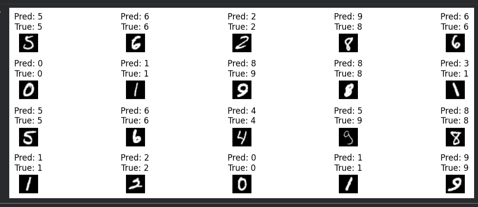
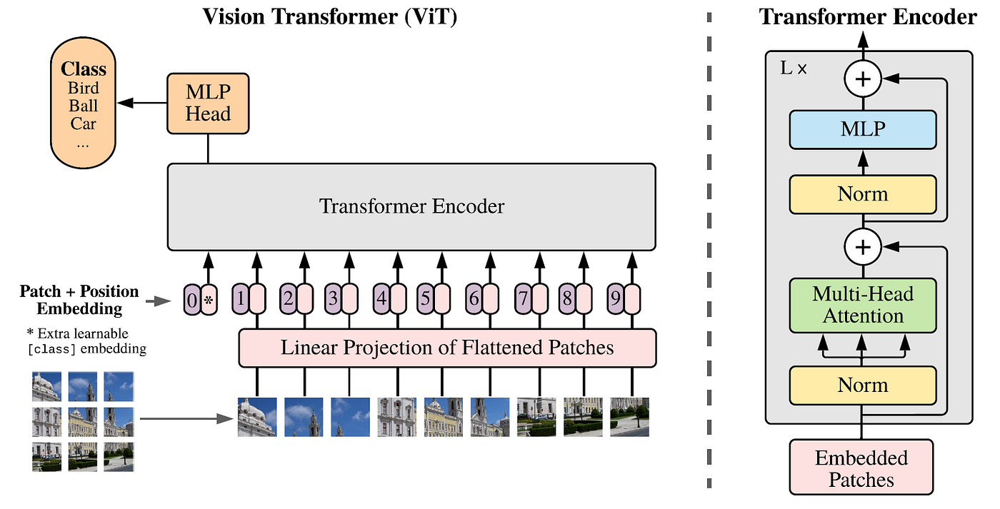

# From Convolutions to Attention: Image Classification with CNNs and the Case for Vision Transformers

## Overview

This project implements an image classification pipeline on the MNIST handwritten digit dataset using a Convolutional Neural Network (CNN) in PyTorch. Beyond the implementation, this README examines why CNNs, despite their success, carry fundamental limitations in visual understanding and why the field has shifted toward attention-based architectures like the Vision Transformer (ViT).

---

## Results

| Metric | Value |
|---|---|
| Final Training Accuracy | ~89–95% (per batch, Epoch 5) |
| Validation Accuracy | **88.30%** |
| Dataset | MNIST (70,000 grayscale images, 10 classes) |
| Architecture | Custom CNN with Conv2D, MaxPooling, Dropout, FC layers |
| Framework | PyTorch |

Sample predictions on 20 test images show strong performance on clean digits, with occasional misclassification on visually ambiguous cases (e.g., 8 vs 9, 1 vs 7).


*Figure: Model predictions vs ground truth labels on 20 MNIST test images.*

---

## Why CNNs Work And Where They Break

CNNs revolutionized computer vision by introducing two key ideas: **local receptive fields** (each filter sees only a small patch of the image) and **weight sharing** (the same filter slides across the entire image). This made them enormously parameter-efficient and effective at detecting low-level features like edges, corners, and textures.

For a well-defined task like MNIST digit recognition fixed image size, centered objects, minimal background noise CNNs perform reliably. The architecture used here learns hierarchical features: early layers detect strokes and curves, deeper layers combine them into digit shapes.

However, CNNs carry structural limitations that become significant as visual tasks grow more complex:

**1. Rigid spatial hierarchy**
CNNs build understanding bottom-up, layer by layer. A feature detected in one region of the image has no direct way to "communicate" with a feature in a distant region unless they share a receptive field. Capturing long-range dependencies for example, understanding that the top loop of an "8" and the bottom loop belong together requires many stacked layers, which is inefficient and fragile.

**2. No global context by design**
Each convolutional filter operates locally. The model has no explicit mechanism to reason about the full image at once. For tasks like image captioning, visual question answering, or scene understanding, global context is not optional it is central to the task.

**3. Translation equivariance, not invariance**
CNNs are equivariant to translation (if the digit shifts, the feature map shifts accordingly). This is useful but also means the model can be sensitive to position, scale, and rotation in ways that require data augmentation to compensate for, rather than learning true geometric invariance.

**4. Fixed receptive field size**
The receptive field of a CNN filter is fixed at design time. If you want to capture both fine-grained texture and broad spatial structure simultaneously, you need parallel branches (Inception) or very deep networks both of which increase complexity significantly.

---

## The Case for Attention: Vision Transformers (ViT)

The Transformer architecture, originally designed for natural language processing, introduced a fundamentally different way of processing sequences: **self-attention**. Instead of processing inputs locally and building up context through layers, self-attention allows every element to directly attend to every other element in a single operation.

In 2020, Dosovitskiy et al. proposed the **Vision Transformer (ViT)**, which applies this idea directly to images. The key insight is simple: split an image into fixed-size patches, treat each patch as a "token" (analogous to a word in NLP), and run a standard Transformer encoder on the sequence of patch embeddings.


*Figure: Vision Transformer (ViT) architecture. The image is divided into fixed patches, each linearly embedded and combined with positional encodings, then passed through a standard Transformer encoder. A classification token [CLS] aggregates global information for the final prediction.*

### What ViT fixes

| Limitation in CNNs | How ViT addresses it |
|---|---|
| Local receptive fields only | Every patch attends to every other patch from layer 1 |
| No global context | [CLS] token aggregates information from the entire image |
| Rigid spatial hierarchy | Positional encodings are learned, not hardcoded |
| Fixed filter size | Multi-head attention captures both local and global patterns simultaneously |

### The tradeoff

ViT requires significantly more data to train from scratch than CNNs. On small datasets like MNIST, a simple CNN will outperform a ViT trained from scratch because the inductive biases of convolution (locality, translation equivariance) are actually well-suited to the task. ViT's strength emerges at scale large datasets, large models, and transfer learning scenarios where pre-trained patch embeddings carry rich semantic information.

This is precisely why the current direction in CV research is **hybrid architectures**: CNN backbones for low-level feature extraction combined with Transformer encoders for global reasoning. Models like CLIP, DINO, and Stable Diffusion's image encoder all follow this pattern.

---

## Project Structure

```
├── model.py          # CNN architecture definition
├── train.py          # Training loop with batch logging
├── evaluate.py       # Validation accuracy and prediction visualization
├── requirements.txt  # Dependencies
└── README.md
```

---

## Setup and Usage

```bash
pip install torch torchvision matplotlib

# Train the model
python train.py

# Evaluate and visualize predictions
python evaluate.py
```

---

## Dependencies

- Python 3.8+
- PyTorch
- torchvision
- matplotlib
- numpy

---

## What's Next

- Replacing the CNN backbone with a **ViT-based patch embedding encoder** and comparing validation accuracy on MNIST directly
- Experimenting with hybrid architectures: CNN for low-level feature extraction combined with a Transformer encoder for global reasoning
- Testing on more complex datasets like CIFAR-10 and CIFAR-100 to stress-test the architectural differences at scale

---

## References

- LeCun et al. (1998). Gradient-Based Learning Applied to Document Recognition.
- Vaswani et al. (2017). Attention Is All You Need.
- Dosovitskiy et al. (2020). An Image is Worth 16x16 Words: Transformers for Image Recognition at Scale.
